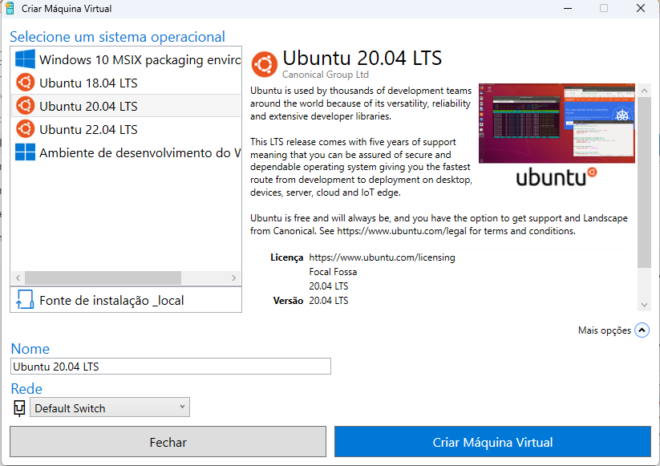

<h1>CREATING A VIRTUAL MACHINE WITH HYPER-V ON WINDOWS 11 PRO</h1>
<h1>(Criando uma máquina virtual com Hyper-V no Windows 11 Pro)<h1>
<h2>Activating Hyper-V</h2>
<h2>(Ativando o Hyper-V)</h2>
To use Hyper-V on Windows 11 Pro you will need to activate this option in the Control Panel. 
(Para usar o Hyper-V no Windows 11 Pro será necessário ativar esta opção no Painel de Controle.) 

Reboot the system after that. 
(Reinicie o sistema depois disso.) 

<h2>Creating the VM</h2>
<h2>(Criando a máquina virtual)</h2>

1. Open Hyper-V Quick Create (Abra o Hyper-V Quick Create)

2. Choose the operating system (Escolha o sistema operacional)

You can download the desired image (.ISO) before you create your VM. Otherwise, you can use the options available in Hyper-V Quick Create. 
(Você pode fazer o download da imagem desejada, no formato .ISO, antes de criar sua VM. Ou pode usar uma das opções disponíveis no Hyper-V Quick Create.) 

3. Click on Create Virtual Machine (clique em Criar Máquina Virtual)
In this example, I selected Ubuntu 20.04 LTS. (Neste exemplo, selecionei o Ubuntu 20.04 LTS)

The image will be downloaded and extracted. (A imagem será transferida e extraída). 

4. Connect to the VM (conecte-se à máquina virtual)

At this point, you may run into problems if your hardware resources are insufficient.  
To check if the host machine has sufficient resources available, you may use the Windows Resource Monitor. 
(Neste ponto, você pode ter problemas se o hardware da máquina hospedeira for insuficiente. Para verificar se esta máquina possui recursos disponíveis suficientes, você pode usar o Monitor de Recursos do Windows.) 

